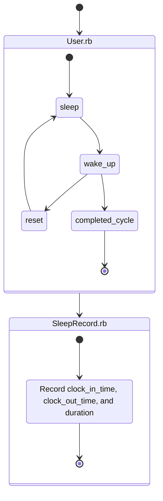
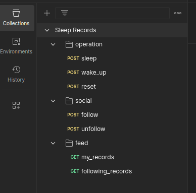

# Setup

- ruby: 3.3.6
- rails: 8.0.0
- database: SQLite... :)

```bash
# setup everything including data seeds
bin/setup

# run..
rails s
```

# Base Concept



# Postman Collection

Import this [Collection (v2.1)](doc/sleep_records.postman_collection.json) file.


